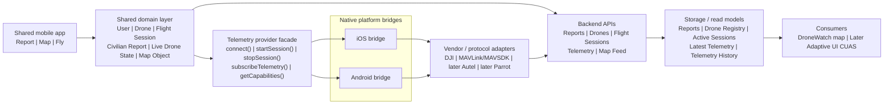

# DroneWatch high-level architecture

## Overview

DroneWatch is a cross-platform mobile product with three user-facing modes:

- **Report**
- **Map**
- **Fly**

The product combines two distinct upstream source types:

- `civilian_report`
- `cooperative_telemetry`

These source types must remain distinct all the way through the backend and map layer.

## High-level system shape

- shared mobile app core
- shared domain models
- normalized backend contracts
- pluggable telemetry provider architecture
- downstream consumer integration through versioned APIs

## Key product boundary

DroneWatch is the producer of report and telemetry data.
Adaptive UI CUAS is a consumer of DroneWatch read APIs.
Integration happens through versioned APIs and read models, not shared database access.

## Mermaid diagram

## Core architectural rules

1. The product core is shared.
2. Telemetry integrations are modular.
3. The app depends on capabilities, not brands.
4. The backend receives normalized telemetry, not raw vendor-specific models.
5. Reports and cooperative telemetry remain distinct source types.
