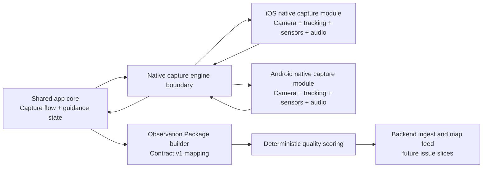

# Mobile Capture Architecture

Updated: May 15, 2026

## Status

Active architecture note for the guided-capture prototype.

This document supports GitHub issue #8 and PRD v2. It supersedes provider-first mobile implementation assumptions for the active prototype milestone. DJI/provider work remains parked research and is not part of this capture architecture.

## Goal

Define how DroneWatch mobile apps capture a civilian airborne observation with a camera-first UX and turn the result into an Observation Package v1.

The architecture must support:

- iOS and Android from the start
- a camera view with reticle, target indicator and progress guidance
- real-time target tracking evidence
- device motion, heading and location evidence
- optional audio-derived evidence
- deterministic quality scoring inputs
- future ML readiness without requiring ML in the first prototype

## Non-goals

This architecture does not:

- implement the capture UI
- choose final tracking, vision or audio libraries
- implement video processing
- implement backend ingest
- implement machine learning
- classify the object as a drone, bird or aircraft
- integrate official sensors or commercial-drone telemetry

## Architecture Summary

DroneWatch should not assume a pure cross-platform camera and tracking stack.

The shared app core owns product flow, state, contract mapping and user-facing guidance rules. Native platform capture modules own camera preview, frame access, target tracking, device sensors and optional audio feature extraction.



## Shared App Core Responsibilities

The shared app core should own product semantics and platform-independent behavior:

- start, pause, complete and cancel the guided observation session
- maintain capture-session state
- request native capture capability status
- translate native capture events into user guidance
- decide when enough evidence has been collected for a usable package
- map native evidence into Observation Package v1
- preserve the separation between `humanReport`, `evidence`, `derivedEvidence` and `validationJoin`
- expose progress and quality hints to the UI
- keep civilian-report observations distinct from any future cooperative telemetry

The shared app core should not own:

- direct camera frame acquisition
- platform camera preview rendering
- low-level target tracking implementation
- direct Core Motion / Android SensorManager access
- direct microphone capture
- native permission prompts beyond requesting them through platform facades

## Native Capture Engine Responsibilities

Each platform should provide a native capture engine behind the same conceptual boundary.

Native responsibilities:

- render or supply the live camera preview surface
- provide frame access suitable for real-time tracking
- run the initial target acquisition and tracking loop
- emit normalized bounding-box trace samples
- emit tracking confidence, lost-target and reacquisition events
- read device heading, orientation, gyro and accelerometer data
- read device location and location accuracy when allowed
- optionally capture audio-derived features
- avoid storing raw media by default
- report permission and capability state to the shared core

Native modules may use platform-specific APIs and libraries. The shared core should only depend on normalized events and evidence summaries.

## Capture Engine Boundary

The native capture engine should expose a small capability-oriented interface. Exact language bindings can differ by platform, but the product boundary should stay stable.

Conceptual interface:

```text
NativeCaptureEngine
  getCapabilities() -> CaptureCapabilities
  requestPermissions(requiredCapabilities) -> PermissionState
  startSession(config) -> CaptureSessionHandle
  acquireTarget(screenPoint | boundingBoxHint) -> TargetTrackId
  subscribeEvents(sessionHandle, callback)
  completeSession(sessionHandle) -> NativeEvidenceBundle
  cancelSession(sessionHandle)
```

Event types emitted to the shared core:

- `previewReady`
- `targetAcquired`
- `trackingSample`
- `targetLost`
- `targetReacquired`
- `motionSample`
- `headingSample`
- `locationSample`
- `audioFeatureSample`
- `qualityProgress`
- `permissionChanged`
- `captureError`

The native engine should not emit provider-specific aircraft telemetry. It emits observation evidence captured by the phone.

## Observation Package Flow

The package flow should be deterministic and reviewable:

1. User starts guided capture.
2. Shared app core opens a capture session and requests native capabilities.
3. Native module starts preview, sensors and optional audio features.
4. User points at the object and starts or confirms target tracking.
5. Native module streams normalized evidence events.
6. Shared app core shows real-time guidance: keep object in frame, tracking strength, progress and quality hints.
7. Shared app core completes the session when enough evidence exists or when the user ends capture.
8. Observation Package builder writes:
   - `captureSession`
   - `humanReport`
   - `evidence.tracking`
   - `evidence.motion`
   - optional `evidence.audio`
   - `derivedEvidence`
   - `validationJoin`
   - `privacy`
9. Deterministic scoring adds quality label, score, quality signals and reason codes.
10. Later slices can send the package to backend ingest and map visualization.

## Evidence Mapping

| Observation Package area | Shared app core | Native capture module |
| --- | --- | --- |
| `captureSession` | Creates ids, start/end state, mode, app version | Supplies platform/device metadata |
| `humanReport` | Stores user note, count and confidence | Not responsible |
| `evidence.tracking` | Normalizes session-level tracking summary | Supplies boxes, confidence, lost and reacquired events |
| `evidence.motion` | Normalizes final bearing and stability summary | Supplies heading, orientation, gyro and accelerometer samples |
| `evidence.audio` | Decides whether audio evidence is present | Supplies derived audio feature samples when enabled |
| `derivedEvidence` | Runs deterministic scoring and reason-code mapping | May supply raw progress signals only |
| `validationJoin` | Creates join keys and uncertainty fields | Supplies location, heading and timestamp evidence |
| `privacy` | Applies retention and precision policy | Avoids raw media by default |

## UX Data Loop

The UI should be able to react to capture state without understanding native implementation details.

Minimum shared guidance signals:

- target acquired or not acquired
- tracking duration progress
- continuity / lost-target warning
- visual confidence
- motion stability
- heading confidence
- location availability
- optional audio availability
- current provisional quality label: weak, moderate or strong

This supports a civilian-readable experience: "keep the object in the box", "hold steadier", "almost enough evidence", "observation captured".

## iOS Implementation Implications

Likely iOS native responsibilities:

- camera preview and frame access through AVFoundation
- initial tracking through platform vision APIs or a lightweight local tracker
- heading, attitude, gyro and accelerometer through Core Motion and Core Location
- optional derived audio features through AVAudioEngine or lower-level audio capture
- native permission handling for camera, motion, location and microphone

iOS should expose normalized evidence events to the shared app core rather than leaking AVFoundation, Core Motion or Vision object types into shared product code.

### iOS Tracking Spike Status

Implemented: May 15, 2026

The first iOS prototype spike uses AVFoundation frame access plus Vision object tracking after the user taps a target region in the camera viewport.

What this spike currently proves:

- the app can nominate a user-selected target area instead of running broad automatic detection
- the camera frame stream can feed a native Vision tracker
- the UI bounding box can be driven by tracker output rather than mock drift
- low confidence or missing tracking output can transition the capture flow to `target_lost`
- the Observation Package preview can include real bounding-box trace samples, confidence values and target-lost reason codes

Known prototype limits:

- tracking quality depends heavily on contrast, object size and camera motion
- coordinate conversion currently assumes the portrait iOS camera viewport used by the prototype
- reacquisition is not implemented yet; after target loss the user should reset or tap again
- this does not classify the target as a drone, bird or aircraft
- this is not a production-grade tracker and still needs field testing on a real flying object

## Android Implementation Implications

Likely Android native responsibilities:

- camera preview and frame access through CameraX or equivalent platform camera APIs
- initial tracking through platform vision APIs or a lightweight local tracker
- heading, gyro and accelerometer through SensorManager
- location through Android location services
- optional derived audio features through AudioRecord or equivalent APIs
- native permission handling for camera, sensors, location and microphone

Android should expose the same normalized evidence event model as iOS, even if the underlying libraries differ.

## Permission and Degradation Model

The architecture should degrade gracefully:

- Camera is required for guided capture.
- Motion/heading is strongly preferred for map usefulness.
- Location is strongly preferred for validation and map placement.
- Audio is optional and secondary in v1.
- Raw media is off by default.

Missing optional evidence should reduce quality or produce reason codes, not crash the session.

Examples:

- missing audio -> valid package with `audio_unavailable`
- missing location -> package can exist, but map placement and validation confidence are reduced
- unstable heading -> package can exist, but heading confidence and quality are reduced
- target lost quickly -> package may complete as weak or insufficient

## Review Checklist

- Shared and native responsibilities are separated.
- iOS and Android are both supported from the start.
- Camera/tracking is explicitly native-capable, not assumed to be pure cross-platform.
- Observation Package v1 is the central output.
- The design supports deterministic scoring and future ML readiness.
- The design does not reactivate DJI/provider work.
- The design does not classify the object type.
