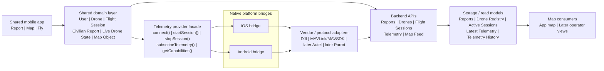

# DroneWatch — Product Requirements Document v1

## 1. Product summary

**DroneWatch** is a cross-platform mobile app for shared drone awareness.

It combines three core capabilities:

1. **Report**  
   Civilians can quickly report a possible drone sighting.

2. **Map**  
   The app visualizes reported sightings and voluntary drone activity on a map.

3. **Fly**  
   Hobby drone operators can register their drone, start a flight session, and voluntarily share live location while flying.

The product’s core value is not just reporting. It is creating a **shared situational layer** where:
- uncertain civilian observations
- and structured cooperative drone telemetry

can be viewed together without pretending they are the same kind of truth.

The current CRA prototype already proves:
- fast native reporting UX
- backend submission
- Cloudflare Worker + D1 storage
- separate repo and thin API shape

---

## 2. Problem

Drone-related awareness is fragmented.

Today:
- civilians may observe drones but have no structured way to report them quickly
- hobby pilots may be flying legally, but that visibility is not shared in any useful public/product layer
- operators or stakeholders looking at the broader picture may lack a simple way to distinguish:
  - reported sightings
  - from cooperative drone activity

This creates a noisy and incomplete picture.

---

## 3. Product vision

DroneWatch creates a shared drone-awareness layer by combining:
- **human observation**
- **voluntary operator telemetry**
- **map-based visibility**

into one product.

It is not an air-defense system.  
It is not an autonomous truth engine.  
It is a **structured situational-awareness product**.

---

## 4. Product goals

### Primary goals
- enable ultra-fast civilian drone sighting reports
- provide a map view of incoming reports
- support voluntary live flight sharing by hobby drone operators
- maintain clear source distinction between reports and live telemetry
- support both **iOS and Android** from one shared product codebase

### Secondary goals
- create a modular architecture that can support multiple drone manufacturers over time
- normalize telemetry from different vendors into one backend contract
- keep the system extensible for later operator-side integrations

---

## 5. Users and roles

### A. Observer
A civilian or member of the public who wants to report a possible drone sighting.

Needs:
- speed
- low friction
- clear location handling
- simple confirmation

### B. Pilot
A hobby drone operator who wants to:
- register a drone
- start a flight session
- voluntarily share live flight location

Needs:
- easy drone registration
- reliable telemetry connection
- clear start/stop flight state
- transparency about what is being shared

### C. Viewer
A user who wants to view the map and understand:
- what has been reported
- what drones are voluntarily broadcasting live position

Needs:
- clear map semantics
- clear distinction between source types
- simple filtering

---

## 6. Product scope

## In scope

### Feature 1 — Civilian reporting
- fast structured reporting flow
- optional note
- location transparency
- backend submission and storage

### Feature 2 — Map
- in-app map showing:
  - civilian drone reports
  - voluntary live drone telemetry
- distinct visual treatment by source type
- basic filtering and recency behavior

### Feature 3 — Voluntary pilot flight sharing
- drone registration
- supported-provider selection
- start/stop flight session
- live telemetry publishing to backend
- map visualization of active cooperative drone position

### Cross-platform architecture
- one shared mobile product core
- iOS + Android deployment
- vendor-specific integrations via modular provider architecture

## Out of scope for v1
- clustering of civilian reports
- AI-based scoring
- deduplication
- hostile/threat classification
- enforcement workflows
- operator command-and-control actions
- production-grade public identity/reputation system
- full regulatory/Remote ID integration as a backbone
- support for every drone brand from day one

---

## 7. Core product principles

1. **Speed first for reporting**  
   Reporting must stay fast and lightweight.

2. **Source honesty**  
   Civilian reports and cooperative telemetry must remain visibly distinct.

3. **Shared app, modular integrations**  
   The product core is shared, telemetry integrations are pluggable.

4. **Backend normalization**  
   Vendor-specific telemetry is normalized before it reaches the map layer.

5. **Cross-platform by design**  
   iOS and Android are a core architecture requirement, not a later porting exercise.

---

## 8. Functional requirements

## 8.1 Reporting

The app must allow an observer to:
- open the app
- choose report mode
- submit a possible drone sighting quickly
- attach device-derived location when available
- optionally use debug/test override in dev contexts
- receive confirmation that the report was submitted

Required report fields:
- observation type
- count estimate
- confidence
- location status

Optional:
- note
- coordinates when available

Reports are stored and later shown on the map.

---

## 8.2 Map

The app must provide a map view that visualizes:

### A. Civilian reports
- point markers
- time-based filtering
- click/tap details
- visibly uncertain / report-based source semantics

### B. Cooperative live drone telemetry
- active drone marker
- session-based live location
- visibly different semantics from civilian reports
- optional model/operator metadata later

The map must not imply that both source types are equivalent.

---

## 8.3 Drone registration and voluntary live flight sharing

The app must allow a pilot to:
- register a drone
- associate it with a supported provider/integration path
- view connection capability/status
- start a flight session
- send live telemetry while flying
- stop the session cleanly

The app must support provider capability differences.

Examples:
- some providers may support live position and battery
- some may support only position
- some may support connection but not full metadata

---

## 9. Architecture requirements

## 9.1 Cross-platform foundation

The product must have:
- one shared mobile app core
- one shared domain model
- one shared backend contract layer

The shared app core owns:
- Report
- Map
- Fly
- shared navigation
- shared state
- backend API client

## 9.2 Telemetry provider architecture

Telemetry support must use a provider abstraction.

The shared app must depend on **capabilities**, not directly on brands.

Example provider interface:
- `connect()`
- `disconnect()`
- `startSession()`
- `stopSession()`
- `subscribeTelemetry()`
- `getCapabilities()`
- `getConnectedVehicleInfo()`

## 9.3 Native bridge requirement

Vendor/protocol integrations must be handled through native iOS/Android bridges where required.

Reason:
drone SDK/protocol access differs by vendor and platform, so this must be a core architecture layer, not an afterthought.

## 9.4 Vendor / protocol adapter layer

The architecture must support pluggable adapters such as:
- DJI
- MAVLink / MAVSDK
- later: Autel
- later: Parrot

v1 should be designed for many, but implement only a small number first.

Recommended first implementations:
- DJI
- MAVLink/MAVSDK

## 9.5 Backend normalization

The backend must ingest normalized telemetry regardless of vendor.

Normalized telemetry object should support:
- provider type
- manufacturer
- model
- drone id
- session id
- timestamp
- lat/lon
- altitude
- speed
- heading
- battery
- metadata

## 9.6 Source semantics

The backend and map must preserve distinct source types:
- `civilian_report`
- `cooperative_telemetry`

---

## 10. High-level architecture diagram

---

## 11. Core entities

### User
- id
- role(s)
- profile metadata

### Drone
- id
- manufacturer
- model
- provider type
- registration status
- capability flags

### DroneRegistration
- user id
- drone id
- provider config status

### FlightSession
- id
- user id
- drone id
- start time
- end time
- active status

### TelemetrySample
- session id
- timestamp
- lat/lon
- altitude
- speed
- heading
- battery
- source/provider metadata

### LiveDroneState
- drone id
- latest known telemetry
- active session id
- freshness state

### CivilianReport
- id
- timestamp
- observation fields
- coordinates if available
- note
- location status

### MapObject
- id
- source type
- coordinates
- display type
- detail payload

---

## 12. Phased implementation recommendation

## Phase 1
Existing CRA baseline
- fast reporting
- backend storage
- map-ready report data

## Phase 2
In-app map
- show civilian reports
- basic filtering
- clear source semantics

## Phase 3
Pilot domain foundation
- drone registry model
- flight session model
- provider abstraction
- placeholder provider capability handling

## Phase 4
First live telemetry integration
- DJI or MAVLink provider
- start/stop flight session
- backend telemetry ingest
- map visualization of live cooperative drone

## Phase 5
Multi-provider expansion
- second provider
- capability matrix
- stronger session UX
- better telemetry resilience

---

## 13. Risks and constraints

### 1. Vendor fragmentation
Different manufacturers expose very different SDK/protocol paths.

### 2. Cross-platform complexity
One shared app does not eliminate the need for native integration work.

### 3. Semantics risk
If reports and live telemetry are visually flattened together, the product becomes misleading.

### 4. Product sprawl
The app can easily become three half-products unless roles and source types are kept disciplined.

---

## 14. Open questions

- Is the map view public to all users, or role-dependent later?
- Is pilot registration fully anonymous, pseudonymous, or account-based?
- How visible should live operator telemetry be to non-pilot users?
- Do we want “known cooperative drone activity nearby” messaging as a UX layer later?
- Which provider is first: DJI or MAVLink?

---

## 15. Recommendation

The most robust and flexible architecture is:

**one shared cross-platform app core**  
**plus a pluggable telemetry-provider system**  
**plus normalized backend contracts**  
**plus strict source-type separation on the map**

That is the right foundation if you want breadth later without turning the codebase into vendor-specific spaghetti.
